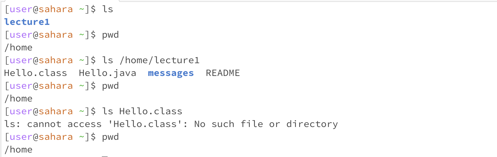
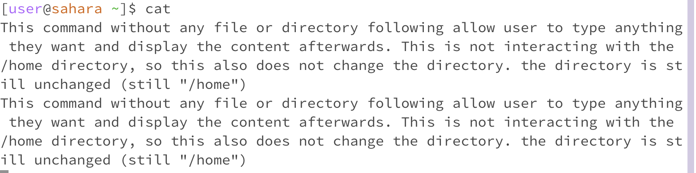
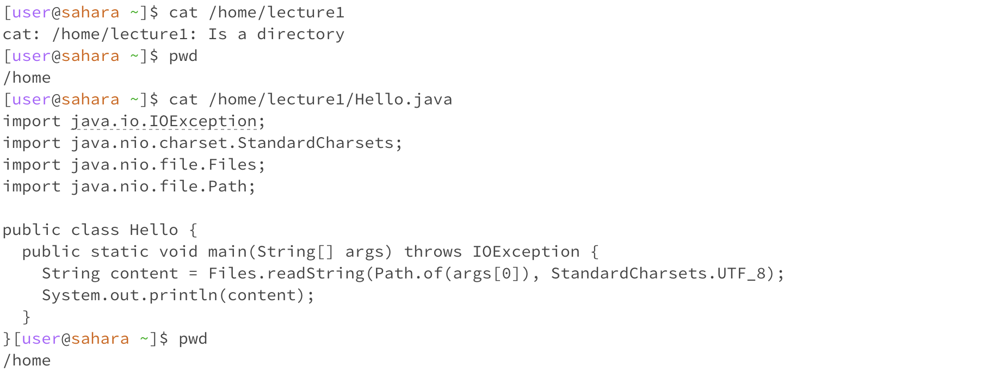

# Lab Report 0

## The `cd` command

1. the "cd" with no arguments runs in the home directory, as shown in the screen shot (the directory is /home). It changes the working directory for the terminal to /home. 
2. the "cd" with a working directory as an argument runs in the working directory it used as arguments, in this example, the diretory is /home/lecture1, as it changes the working directory to /home/lecture1 as asked
3. the "cd" with a file as and argument raised an error, since the cd cannot set a file as working directoy. As a file is not a directory, an error raised. As this is a following step of step 2, the working directory remains the same as step 2, which is still /home/lecture1

## The ls command

1. the "ls" with no argument list the files and folders in the home directory, when we use the pwd to check the current working directory, we can see that the "ls" command does not change working directory, and the working directory is still "/home".
2. the "ls" with a working directory named "/home/lecture1" list the files and folders in the lecture1 directory, when we use the pwd to check the current working directory, we can see that the "ls" command does not change working directory, and the working directory is still "/home".
3. the "ls" with a file named "Hello.class" encounter an error, as the "ls" command list our the folders or files in a "path", when we use the pwd to check the current working directory, we can see that working directory remains the same, and the working directory is still "/home".

## The cat command

1. please see the screen-shot for info (I answered the question there)

2. the "cat" command encountered an error when in the case where it follows with a error "cat: /home/lecture1: Is a directory," which implying that this command cannot used with working directories as there is no "content" to be printed out in working directories. The path remained unchanged when we apply the code "pwd," we can see the working directory is still /home.
3. the "cat" command print out the content in the file /home/lecture1/Hello.java, and when we open the file by hand, we can see the exact same content as shown here. The path remained unchanged when we apply the code "pwd," we can see the working directory is still /home.
