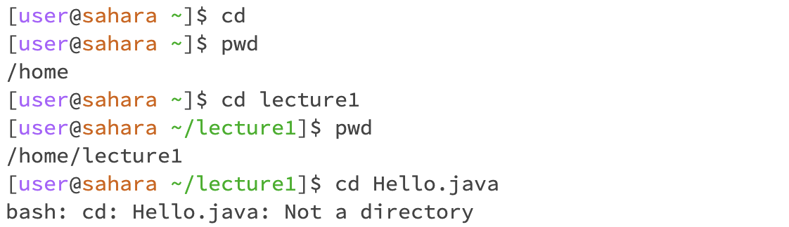

# Lab Report 0

## The `cd` command

### `cd` with no argument:
1. Working Directory: /home
2. Output (result): the result is not visible, and you will be "directed" to the /home directory, as you are already in the /home directory, this commend will have no impact

### `cd`with a working directory as argument:
1. Working Directory: /home
2. Output (result): this commend will change the current working directory from /home to /home/lecture1

### `cd` with a file name as argument
1. Working Directory: /home
2. Output (result): this commend will encounter an error, as we cannot set a file as working directory

## The `ls` command

### `ls` with no argument:
1. Working Directory: /home
2. Output (result): the "ls" with no argument list the files and folders in the current working directory, which is the /home directory

### `ls`with a working directory (in this case /home/lecture1) as argument:
1. Working Directory: /home
2. Output (result): the "ls" with a working directory named "/home/lecture1" list the files and folders in the lecture1 directory

### `ls` with a file name (the path for the file is /home/lecture1/Hello.java) as argument:
1. Working Directory: /home/lecture1
2. Output (result): Since Hello.java is a single file, the listing of files and folders in /home/lecture1/Hello.java is just Hello.java itself.

## The `ls` command

### `ls` with no argument:
1. Working Directory: /home
2. Output (result): the "ls" with no argument list the files and folders in the current working directory, which is the /home directory

### `ls`with a working directory (in this case /home/lecture1) as argument:
1. Working Directory: /home
2. Output (result): the "ls" with a working directory named "/home/lecture1" list the files and folders in the lecture1 directory

### `ls` with a file name (the path for the file is /home/lecture1/Hello.java) as argument:
1. Working Directory: /home/lecture1
2. Output (result): Since Hello.java is a single file, the listing of files and folders in /home/lecture1/Hello.java is just Hello.java itself.
